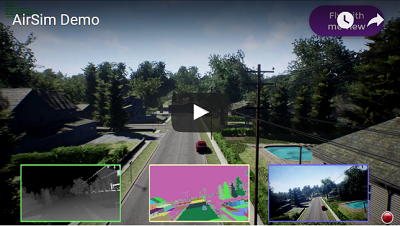

# 欢迎来到 AirSim

AirSim是一个基于虚幻引擎（我们还有一个支持Unity的试验性版本）以模拟汽车、无人机的模拟器。AirSim仿真模拟平台是开源、跨平台、支持诸如PX4等常见的硬件在环（hardware-in-loop）飞行遥控器。AirSim是一个虚幻引擎插件，所以它可被移植到任意的虚幻环境中。同样，我们有一个试验性的Unity版本插件。

我们的目标是将AirSim发展成一个可以实验自动驾驶汽车的深度学习，计算机视觉和强化学习算法的人工智能研究平台。 为此，AirSim还公开了API，用以以独立于平台的方式检索数据和控制车辆。

**查看一分三十秒的快速演示（Youtube）**

AirSim中运行无人机

[](https://youtu.be/-WfTr1-OBGQ)

AirSim中运行汽车

[](https://youtu.be/gnz1X3UNM5Y)

## 最近更新

* 添加了天气环境和相关的 [APIs](https://frendowu.github.io/AirSim-docs-zh/apis/)
* 添加了 [时刻API](https://frendowu.github.io/AirSim-docs-zh/apis/)
* 一个试验性的 [Unity上运行AirSim](https://github.com/Microsoft/AirSim/tree/master/Unity) 目前可用。了解详情： [Unity blog post](https://blogs.unity3d.com/2018/11/14/airsim-on-unity-experiment-with-autonomous-vehicle-simulation).
* [新的环境](https://github.com/Microsoft/AirSim/releases/tag/v1.2.1)：森林、平原（风车农场）、TalkingHeads（模拟人体头部）、TrapCam（通过相机进行动物检测）
* [NoDisplay视图](https://microsoft.github.io/AirSim/docs/settings#viewmode) 可以关闭主屏幕渲染，以便您可以更高效地截取图像。
* [Lidar传感器](https://microsoft.github.io/AirSim/docs/lidar)
* 一个机器学习的例子：[方程式赛车的自动驾驶](https://github.com/Microsoft/AirSim/wiki/technion)
* [多车模式](https://microsoft.github.io/AirSim/docs/multi_vehicle)
* [ROS发布器](https://github.com/Microsoft/AirSim/pull/1135)

更多详情，请参考 [Changelog](CHANGELOG.md)

## 如何获得它

### Windows

* [下载二进制文件](https://microsoft.github.io/AirSim/docs/use_precompiled)
* [在Windows上Build](https://microsoft.github.io/AirSim/docs/build_windows)

### Linux

* [在Linux上Build](https://microsoft.github.io/AirSim/docs/build_linux)

[](https://travis-ci.org/Microsoft/AirSim)

## 如何使用它

### 文档

可以参考我们有关AirSim各方面的[详细文档](https://frendowu.github.io/AirSim-docs-zh/)。

### 人工驾驶

如果您有如下所示的遥控器（RC），您可以在模拟器中手动控制无人机。 您也可以使用方向键手动驾驶汽车。

[更多细节](https://microsoft.github.io/AirSim/docs/remote_control/)


### 编程控制

AirSim公开了API，因此您可以通过编程方式在仿真环境中与车辆进行交互。 您可以使用这些API来检索图像，获取状态，控制车辆等。 API通过RPC公开，可通过各种语言访问，如C ++，Python，C＃和Java。

这些API也可以以独立跨平台库的方式提供，因此您可以将它们部署在车辆的计算机上。 这样，您就可以在模拟器中编写和测试代码，然后在真实车辆上执行它。 迁移学习和相关研究是我们关注的重点领域之一。

您可以修改 [SimMode选项](https://microsoft.github.io/AirSim/docs/settings#simmode) 来配置默认车辆或新的 [计算机视觉模式](https://microsoft.github.io/AirSim/docs/image_apis#computer-vision-mode-1) ，这样您就不必每次启动AirSim时都收到提示。

[More details](https://microsoft.github.io/AirSim/docs/apis/)

### 获取训练数据

有两种方法可以从AirSim生成训练数据以进行深度学习。 最简单的方法是点击右下角的录制按钮。这将开始记录每一帧的位置和图像。 获取数据的相关代码非常简单，您可以根据自己的需求对其进行修改。


另一个更好的方法是通过访问API，以您希望的方式生成训练数据。 因此您可以完全控制记录数据的方式，内容，位置和时间（how, what, where and when）。

### 计算机视觉模式

AirSim的另一个用途是所谓的“计算机视觉”模式。 在这种模式下您没有车辆，也没有物理限制。 您可以使用键盘在场景中移动，或使用API以任意姿势定位可用摄像机，然后收集如深度，视差，曲面法线或对象分割等图像数据。

[更多细节](https://microsoft.github.io/AirSim/docs/docs/image_apis/)

### 天气状态

按下键盘“F10”来查看可以使用的天气状态。您也可以通过[APIs](https://microsoft.github.io/AirSim/docs/apis#weather-apis)来控制天气。按下键盘"F1"来查看别的可用选项。 


## 教程

- [Video - Setting up AirSim with Pixhawk Tutorial](https://youtu.be/1oY8Qu5maQQ) by Chris Lovett
- [Video - Using AirSim with Pixhawk Tutorial](https://youtu.be/HNWdYrtw3f0) by Chris Lovett
- [Video - Using off-the-self environments with AirSim](https://www.youtube.com/watch?v=y09VbdQWvQY) by Jim Piavis
- [Reinforcement Learning with AirSim](https://microsoft.github.io/AirSim/docs/reinforcement_learning) by Ashish Kapoor
- [The Autonomous Driving Cookbook](https://aka.ms/AutonomousDrivingCookbook) by Microsoft Deep Learning and Robotics Garage Chapter
- [Using TensorFlow for simple collision avoidance](https://github.com/simondlevy/AirSimTensorFlow) by Simon Levy and WLU team

## 参与

### Paper

更多的细节都在下面这篇论文：[AirSim paper (FSR 2017 Conference)](https://arxiv.org/abs/1705.05065)。请以下面的格式引用该论文：
```
@inproceedings{airsim2017fsr,
  author = {Shital Shah and Debadeepta Dey and Chris Lovett and Ashish Kapoor},
  title = {AirSim: High-Fidelity Visual and Physical Simulation for Autonomous Vehicles},
  year = {2017},
  booktitle = {Field and Service Robotics},
  eprint = {arXiv:1705.05065},
  url = {https://arxiv.org/abs/1705.05065}
}
```

### 贡献

如果您希望贡献自己的一份力量，请解决 [open issues](https://github.com/microsoft/airsim/issues) 里的问题。

* [AirSim的架构](https://microsoft.github.io/AirSim/docs/design)
* [代码结构](https://microsoft.github.io/AirSim/docs/code_structure)
* [贡献指引](CONTRIBUTING.md)
* [Trello公告板](https://trello.com/b/1t2qCeaA/wishlist-by-community-for-community)

### 谁在使用AirSim？

这份[列表](https://microsoft.github.io/AirSim/docs/who_is_using)包含我们已知的，在使用AirSim的项目、研究人员或研究团队。如果您想进入此份列表，请在此提交您的[请求](https://github.com/microsoft/airsim/issues)。

## 联系我们

欢迎加入我们的 [Facebook](https://www.facebook.com/groups/1225832467530667/) 小组。

## 问与答

如果您还有问题，请参阅 [FAQ](https://microsoft.github.io/AirSim/docs/faq)，也可以在代码仓库中给我们提 [Issue](https://github.com/Microsoft/AirSim/issues) 。

## 许可

该项目根据[MIT许可证](../LICENSE)发布。
